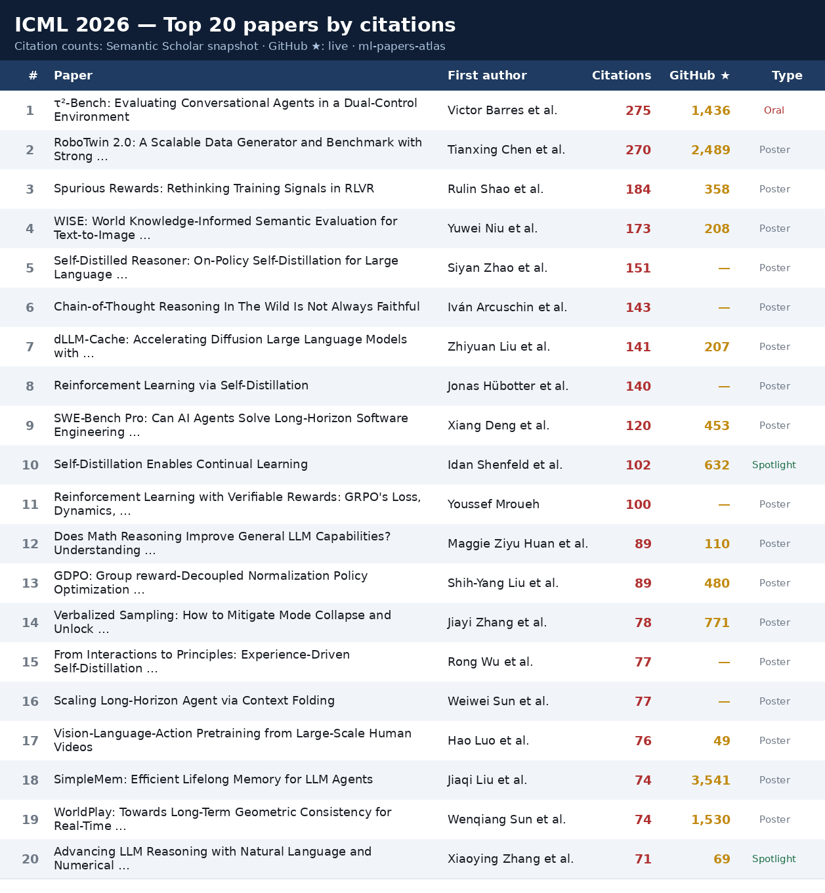
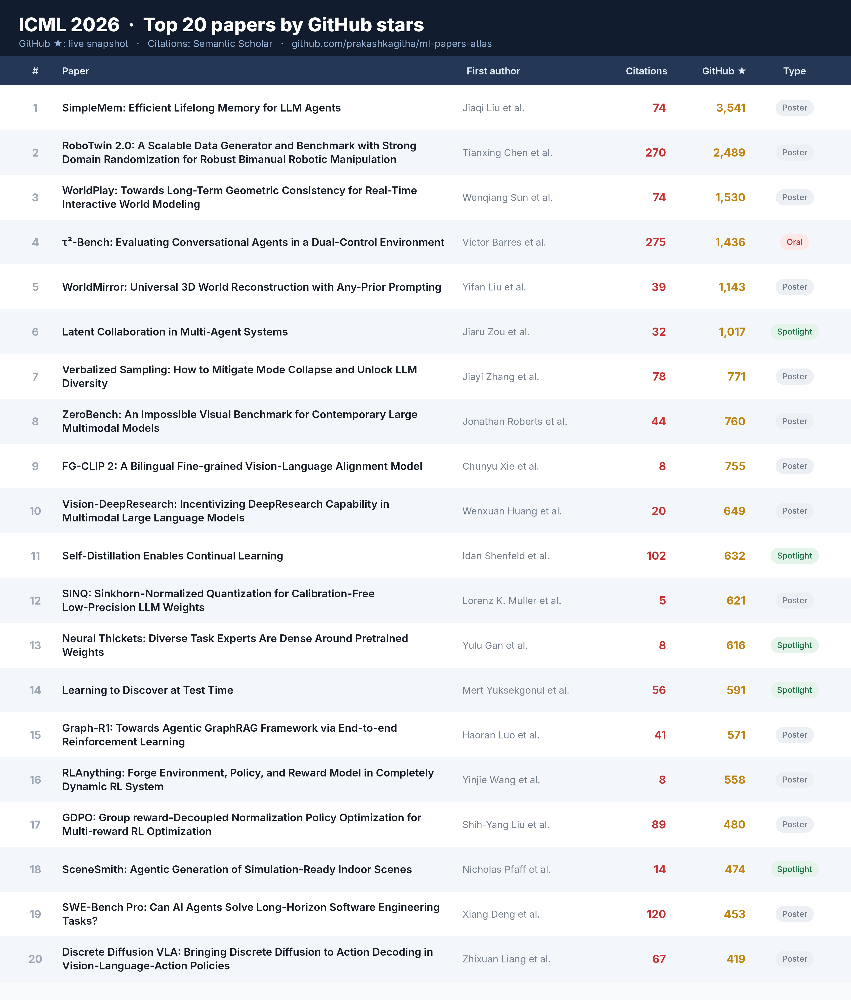

# ICML 2026 — Most-Cited & Most-Adopted Papers

> An open, reproducible look at which **ICML 2026** papers are landing — by academic **citations** (Semantic Scholar) and by code **adoption** (GitHub stars). Part of [**ml-papers-atlas**](https://github.com/prakashkagitha/ml-papers-atlas): mapping ML-conference papers to arXiv, citations, and author/lab connections.

**6,343** accepted main-conference papers · **4,192** matched to Semantic Scholar · **2,102** with ≥1 citation · **78** with >25 · **10** with >100. Citation counts are a snapshot and skew toward papers that hit arXiv early; most ICML 2026 papers had near-zero citations at snapshot time. Star counts are a live GitHub snapshot.

## Contents

- [📈 Top 20 by citations](#-top-20-by-citations)
- [⭐ Top 20 by GitHub stars](#-top-20-by-github-stars)
- [📋 The ranked list — top 50 papers](#-the-ranked-list--top-50-papers)
- [🔬 Methodology & caveats](#-methodology--caveats)
- [📦 Full corpus & downloads](#-full-corpus--downloads)

---

## 📈 Top 20 by citations

## ⭐ Top 20 by GitHub stars

An adoption proxy that surfaces hot, code-shipping papers a citation count misses (the two lists barely overlap — citation leaders are established benchmarks/methods; star leaders are recent code-heavy releases).

## 📋 The ranked list — top 50 papers

Primarily ranked by citations (top 30, extended to 50 while > 25 citations); the **top 5 by GitHub stars are woven into the first 10**, so the head reflects both impact and adoption. Each entry links arXiv · code · ICML · the author's X post, and lists the X handle(s) to tag. Same data as the [copy-paste thread](icml2026/outputs/icml2026_thread_plaintext.txt).

<b>#1–#10 — headline papers (citations × stars)</b>

**1. [τ²-Bench: Evaluating Conversational Agents in a Dual-Control Environment](https://arxiv.org/abs/2506.07982)**  
Victor Barres et al. · **275** citations · **1,436**★ · Oral  
Existing benchmarks for conversational AI agents simulate single-control environments, where only the AI agent can use tools to interact with the world, while the user remains a passive information provider. This differs from real-world scenarios like technical support, where users need to actively participate in modifying the state of the (shared) world.  
[arXiv](https://arxiv.org/abs/2506.07982) · [code](https://github.com/sierra-research/tau2-bench) · [ICML](https://icml.cc/virtual/2026/poster/64377) · [X post](https://x.com/SierraPlatform/status/1932464265207889974) · tag [@SierraPlatform](https://x.com/SierraPlatform)

**2. [SimpleMem: Efficient Lifelong Memory for LLM Agents](https://arxiv.org/abs/2601.02553)**  
Jiaqi Liu et al. · **74** citations · **3,541**★  
To support long-term interaction in complex environments, LLM agents require memory systems that manage historical experiences. Existing approaches either retain full interaction histories via passive context extension, leading to substantial redundancy, or rely on iterative reasoning to filter noise, incurring high token costs.  
[arXiv](https://arxiv.org/abs/2601.02553) · [code](https://github.com/aiming-lab/SimpleMem) · [ICML](https://icml.cc/virtual/2026/poster/61640) · [X post](https://x.com/HuaxiuYaoML/status/2039923459841523807) · tag [@HuaxiuYaoML](https://x.com/HuaxiuYaoML)

**3. [RoboTwin 2.0: A Scalable Data Generator and Benchmark with Strong Domain Randomization for Robust Bimanual Robotic Manipulation](https://arxiv.org/abs/2506.18088)**  
Tianxing Chen et al. · **270** citations · **2,489**★  
Simulation-based data synthesis has emerged as a powerful paradigm for enhancing real-world robotic manipulation. However, existing synthetic datasets remain insufficient for robust bimanual manipulation due to two key challenges: (1) the lack of an autonomous self-correcting mechanism to resolve execution failures in complex coordination tasks, and (2) the scarcity of diverse visual and spatial variations required to bridge the sim-to-real gap.  
[arXiv](https://arxiv.org/abs/2506.18088) · [code](https://github.com/RoboTwin-Platform/RoboTwin) · [ICML](https://icml.cc/virtual/2026/poster/62192) · tag [@MarioChan2002](https://x.com/MarioChan2002)

**4. [WorldPlay: Towards Long-Term Geometric Consistency for Real-Time Interactive World Modeling](https://arxiv.org/abs/2512.14614)**  
Wenqiang Sun et al. · **74** citations · **1,530**★  
This paper presents WorldPlay, a streaming video diffusion model that enables real-time, interactive world modeling with long-term geometric consistency, resolving the trade-off between speed and memory that limits current methods.  
[arXiv](https://arxiv.org/abs/2512.14614) · [code](https://github.com/Tencent-Hunyuan/HY-WorldPlay) · [ICML](https://icml.cc/virtual/2026/poster/65111) · [X post](https://x.com/DylanTFWang/status/2001146210779115550) · tag [@DylanTFWang](https://x.com/DylanTFWang) [@TencentHunyuan](https://x.com/TencentHunyuan)

**5. [Spurious Rewards: Rethinking Training Signals in RLVR](https://arxiv.org/abs/2506.10947)**  
Rulin Shao et al. · **184** citations · **358**★  
We show that reinforcement learning with verifiable rewards (RLVR) can elicit strong mathematical reasoning in certain language models even with spurious rewards that have little, no, or outright negative correlation with the correct answer. For example, RLVR training with GRPO improves MATH-500 performance for Qwen2.5-Math-7B in absolute points by 21.4% using randomly assigned rewards, nearly matching the 29.1% gained with ground truth rewards.  
[arXiv](https://arxiv.org/abs/2506.10947) · [code](https://github.com/ruixin31/Spurious_Rewards) · [ICML](https://icml.cc/virtual/2026/poster/61082) · [X post](https://x.com/StellaLisy/status/1927392717593526780) · tag [@StellaLisy](https://x.com/StellaLisy)

**6. [WorldMirror: Universal 3D World Reconstruction with Any-Prior Prompting](https://arxiv.org/abs/2510.10726)**  
Yifan Liu et al. · **39** citations  
We present WorldMirror, a unified feed-forward model for comprehensive 3D geometric prediction tasks. Unlike existing methods constrained to image-only inputs or customized for a specific task, our framework flexibly integrates diverse geometric priors, including camera poses, intrinsics, and depth maps, while simultaneously generating multiple 3D representations: dense point clouds, multi-view depth maps, camera parameters, surface normals, and 3D Gaussians.  
[arXiv](https://arxiv.org/abs/2510.10726) · [ICML](https://icml.cc/virtual/2026/poster/65052)

**7. [WISE: World Knowledge-Informed Semantic Evaluation for Text-to-Image Generation](https://arxiv.org/abs/2503.07265)**  
Yuwei Niu et al. · **173** citations · **208**★  
Text-to-Image (T2I) models are capable of generating high-quality artistic creations and visual content. However, existing research and evaluation standards predominantly focus on image realism and shallow text-image alignment, lacking a comprehensive assessment of complex semantic understanding and world knowledge integration in text-to-image generation.  
[arXiv](https://arxiv.org/abs/2503.07265) · [code](https://github.com/PKU-YuanGroup/WISE) · [ICML](https://icml.cc/virtual/2026/poster/62614)

**8. [Self-Distilled Reasoner: On-Policy Self-Distillation for Large Language Models](https://arxiv.org/abs/2601.18734)**  
Siyan Zhao et al. · **151** citations  
Knowledge distillation improves large language model (LLM) reasoning by compressing the knowledge of a teacher LLM to train smaller LLMs. On-policy distillation advances this approach by having the student sample its own trajectories while a teacher LLM provides dense token-level supervision, addressing the distribution mismatch between training and inference in off-policy distillation methods.  
[arXiv](https://arxiv.org/abs/2601.18734) · [ICML](https://icml.cc/virtual/2026/poster/64784) · [X post](https://x.com/siyan_zhao/status/2014372747862999382) · tag [@siyan_zhao](https://x.com/siyan_zhao)

**9. [Chain-of-Thought Reasoning In The Wild Is Not Always Faithful](https://arxiv.org/abs/2503.08679)**  
Iván Arcuschin et al. · **143** citations  
Recent studies indicate that when faced with explicit biases in prompts, models often omit mentioning these biases in their Chain-of-Thought (CoT) output, revealing that verbalized reasoning can give an incorrect picture of how models arrive at conclusions (unfaithfulness). In this work, we show that unfaithful CoT also occurs on naturally worded, non-adversarial prompts without adding artificial biases or editing model outputs.  
[arXiv](https://arxiv.org/abs/2503.08679) · [ICML](https://icml.cc/virtual/2026/poster/64450) · [X post](https://x.com/ArthurConmy/status/1874920611354718438) · tag [@IvanArcus](https://x.com/IvanArcus) [@ArthurConmy](https://x.com/ArthurConmy) [@NeelNanda5](https://x.com/NeelNanda5)

**10. [dLLM-Cache: Accelerating Diffusion Large Language Models with Adaptive Caching](https://arxiv.org/abs/2506.06295)**  
Zhiyuan Liu et al. · **141** citations · **207**★  
Autoregressive Models (ARMs) have long dominated the landscape of Large Language Models. Recently, a new paradigm has emerged in the form of diffusion-based Large Language Models (dLLMs), which generate text by iteratively denoising masked segments. This approach has shown significant advantages and potential.  
[arXiv](https://arxiv.org/abs/2506.06295) · [code](https://github.com/maomaocun/dLLM-cache) · [ICML](https://icml.cc/virtual/2026/poster/62405)

<b>#11–#25 — click to expand</b>

**11. [Reinforcement Learning via Self-Distillation](https://arxiv.org/abs/2601.20802)**  
Jonas Hübotter et al. · **140** citations  
Large language models are increasingly post-trained with reinforcement learning in verifiable domains such as code and math. Yet, current methods for reinforcement learning with verifiable rewards (RLVR) learn only from a scalar outcome reward per attempt, creating a severe credit-assignment bottleneck.  
[arXiv](https://arxiv.org/abs/2601.20802) · [ICML](https://icml.cc/virtual/2026/poster/64121) · tag [@jonashuebotter](https://x.com/jonashuebotter)

**12. [SWE-Bench Pro: Can AI Agents Solve Long-Horizon Software Engineering Tasks?](https://arxiv.org/abs/2509.16941)**  
Xiang Deng et al. · **120** citations · **453**★  
We present SWE-Bench Pro, a comprehensive benchmark designed to evaluate software engineering capabilities through complex, realistic programming challenges. This benchmark extends beyond traditional algorithmic problems to encompass the full spectrum of professional software development tasks.  
[arXiv](https://arxiv.org/abs/2509.16941) · [code](https://github.com/scaleapi/SWE-bench_Pro-os) · [ICML](https://icml.cc/virtual/2026/poster/61047) · [X post](https://x.com/vbingliu/status/1969460781495566611) · tag [@vbingliu](https://x.com/vbingliu) [@scale_AI](https://x.com/scale_AI)

**13. [Self-Distillation Enables Continual Learning](https://arxiv.org/abs/2601.19897)**  
Idan Shenfeld et al. · **102** citations · **632**★ · Spotlight  
Continual learning, enabling models to acquire new skills and knowledge without degrading existing capabilities, remains a fundamental challenge for foundation models. While on-policy reinforcement learning can reduce forgetting, it requires explicit reward functions that are often unavailable.  
[arXiv](https://arxiv.org/abs/2601.19897) · [code](https://github.com/idanshen/Self-Distillation) · [ICML](https://icml.cc/virtual/2026/poster/61434) · [X post](https://x.com/IdanShenfeld/status/2016818116441850172) · tag [@IdanShenfeld](https://x.com/IdanShenfeld)

**14. [Reinforcement Learning with Verifiable Rewards: GRPO's Loss, Dynamics, and Success Amplification](https://arxiv.org/abs/2503.06639)**  
Youssef Mroueh et al. · **100** citations  
Group Relative Policy Optimization (GRPO) was introduced recently and used to train DeepSeek\textendash R1 for promoting reasoning in LLMs under verifiable (binary) rewards. We show that the mean{+}variance calibration of these rewards induces a contrastive loss in which the contrastive samples are synthetic data drawn from the previous policy.  
[arXiv](https://arxiv.org/abs/2503.06639) · [ICML](https://icml.cc/virtual/2026/poster/60548)

**15. [Does Math Reasoning Improve General LLM Capabilities? Understanding Transferability of LLM Reasoning](https://arxiv.org/abs/2507.00432)**  
Maggie Ziyu Huan et al. · **89** citations · **110**★  
Math reasoning has become the poster child of progress in large language models (LLMs), with new models rapidly surpassing human-level performance on benchmarks like MATH and AIME. But as math leaderboards improve week by week, it is worth asking: do these gains reflect broader problem-solving ability or just narrow overfitting?  
[arXiv](https://arxiv.org/abs/2507.00432) · [code](https://github.com/ReasoningTransfer/Transferability-of-LLM-Reasoning) · [ICML](https://icml.cc/virtual/2026/poster/65125) · [X post](https://x.com/xiangyue96/status/1940494376133869947) · tag [@xiangyue96](https://x.com/xiangyue96)

**16. [GDPO: Group reward-Decoupled Normalization Policy Optimization for Multi-reward RL Optimization](https://arxiv.org/abs/2601.05242)**  
Shih-Yang Liu et al. · **89** citations · **480**★  
As language models become increasingly capable, users expect them to provide not only accurate responses but also behaviors aligned with diverse human preferences across a variety of scenarios. To achieve this, Reinforcement learning (RL) pipelines have begun incorporating multiple rewards, each capturing a distinct preference, to guide models toward these desired behaviors.  
[arXiv](https://arxiv.org/abs/2601.05242) · [code](https://github.com/NVlabs/GDPO) · [ICML](https://icml.cc/virtual/2026/poster/63333) · tag [@shizhediao](https://x.com/shizhediao)

**17. [Verbalized Sampling: How to Mitigate Mode Collapse and Unlock LLM Diversity](https://arxiv.org/abs/2510.01171)**  
Jiayi Zhang et al. · **78** citations · **771**★  
Post-training alignment often reduces LLM diversity, leading to a phenomenon known as mode collapse. Unlike prior work that attributes this effect to algorithmic limitations, we identify a fundamental, pervasive data-level driver: typicality bias in preference data, whereby annotators systematically favor familiar text as a result of well-established findings in cognitive psychology.  
[arXiv](https://arxiv.org/abs/2510.01171) · [code](https://github.com/CHATS-lab/verbalized-sampling) · [ICML](https://icml.cc/virtual/2026/poster/60489) · [X post](https://x.com/shi_weiyan/status/1978453323167490245) · tag [@shi_weiyan](https://x.com/shi_weiyan) [@JiayiZhang0427](https://x.com/JiayiZhang0427) [@chrmanning](https://x.com/chrmanning)

**18. [From Interactions to Principles: Experience-Driven Self-Distillation for Evolving LLM Agents](https://arxiv.org/abs/2510.16079)**  
Rong Wu et al. · **77** citations  
LLM agents have achieved strong performance in tool-augmented reasoning, but most remain largely stateless: after each episode, the agent discards interaction traces and does not accumulate reusable strategies. Prior work either stores raw trajectories for case-based reuse or relies on external teacher models to write reflections, which limits generalization or leaves the agent’s policy unchanged.  
[arXiv](https://arxiv.org/abs/2510.16079) · [ICML](https://icml.cc/virtual/2026/poster/65641)

**19. [Scaling Long-Horizon Agent via Context Folding](https://arxiv.org/abs/2510.11967)**  
Weiwei Sun et al. · **77** citations  
Large language model (LLM) agents are fundamentally constrained by context length on long-horizon tasks. Existing agent frameworks usually rely on manually defined context engineering pipelines, such as multi-agent or post-hoc summary. We introduce Context Folding, a framework that empowers agents to actively manage their working context.  
[arXiv](https://arxiv.org/abs/2510.11967) · [ICML](https://icml.cc/virtual/2026/poster/61950)

**20. [Vision-Language-Action Pretraining from Large-Scale Human Videos](https://arxiv.org/abs/2507.15597)**  
Hao Luo et al. · **76** citations  
Existing Vision-Language-Action (VLA) models struggle with complex manipulation tasks requiring high dexterity and generalization, primarily due to their reliance on synthetic data with significant sim-to-real gaps or limited teleoperated demonstrations. To address this bottleneck, we propose leveraging human hands as a manipulator template, capitalizing on the rich dexterity and scalability present in web data of human manipulation.  
[arXiv](https://arxiv.org/abs/2507.15597) · [ICML](https://icml.cc/virtual/2026/poster/62813) · tag [@beingbeyond_](https://x.com/beingbeyond_)

**21. [Advancing LLM Reasoning with Natural Language and Numerical Feedback](https://arxiv.org/abs/2506.03106)**  
Xiaoying Zhang et al. · **71** citations · **69**★ · Spotlight  
Recent advances in reinforcement learning (RL) using numerical rewards have significantly enhanced the complex reasoning capabilities of large language models (LLMs). However, we identify three fundamental limitations of purely numerical feedback: performance plateaus, ineffective spontaneous self-reflection, and persistent failures.  
[arXiv](https://arxiv.org/abs/2506.03106) · [code](https://github.com/zhangxy-2019/critique-GRPO) · [ICML](https://icml.cc/virtual/2026/poster/62398)

**22. [Discrete Diffusion VLA: Bringing Discrete Diffusion to Action Decoding in Vision-Language-Action Policies](https://arxiv.org/abs/2508.20072)**  
Zhixuan Liang et al. · **67** citations · **419**★  
Vision–Language–Action (VLA) models adapt large vision–language backbones to map images and instructions into robot actions. However, prevailing VLAs either generate actions autoregressively in a fixed left-to-right order or attach separate diffusion heads outside the backbone, fragmenting information pathways and hindering unified, scalable architectures.  
[arXiv](https://arxiv.org/abs/2508.20072) · [code](https://github.com/JiuTian-VL/Large-VLM-based-VLA-for-Robotic-Manipulation) · [ICML](https://icml.cc/virtual/2026/poster/62902)

**23. [Reinforcement Learning with Evolving Rubrics for Deep Research](https://arxiv.org/abs/2511.19399)**  
Rulin Shao et al. · **61** citations · Oral  
Deep research agents perform multi-step research to produce long-form, well-attributed answers. However, most open deep research agents are trained on easily verifiable short-form QA tasks via reinforcement learning with verifiable rewards, which does not extend to realistic long-form tasks.  
[arXiv](https://arxiv.org/abs/2511.19399) · [ICML](https://icml.cc/virtual/2026/poster/65886) · [X post](https://x.com/faeze_brh/status/1990839185117491266) · tag [@faeze_brh](https://x.com/faeze_brh) [@allen_ai](https://x.com/allen_ai) [@HannaHajishirzi](https://x.com/HannaHajishirzi)

**24. [Causal Forcing: Autoregressive Diffusion Distillation Done Right for High-Quality Real-Time Video Generation](https://arxiv.org/abs/2602.02214)**  
Hongzhou Zhu et al. · **59** citations  
To achieve real-time video generation, current approaches distill pretrained bidirectional video diffusion models into few-step autoregressive (AR) models. This process involves an architectural gap , as it converts full attention into causal attention.  
[arXiv](https://arxiv.org/abs/2602.02214) · [ICML](https://icml.cc/virtual/2026/poster/65646)

**25. [Learning to Discover at Test Time](https://arxiv.org/abs/2601.16175)**  
Mert Yuksekgonul et al. · **56** citations · **591**★ · Spotlight  
How can we use AI to discover a new state of the art for a scientific problem? Prior work in test-time scaling, such as AlphaEvolve, performs search by prompting a frozen LLM. We perform reinforcement learning at test time, so the LLM can continue to train, but now with experience specific to the test problem.  
[arXiv](https://arxiv.org/abs/2601.16175) · [code](https://github.com/test-time-training/discover) · [ICML](https://icml.cc/virtual/2026/poster/65888) · [X post](https://x.com/YejinChoinka/status/2015548029424795998) · tag [@YejinChoinka](https://x.com/YejinChoinka) [@mertyuksekgonul](https://x.com/mertyuksekgonul)

<b>#26–#50 — click to expand</b>

**26. [DreamDojo: A Real-Time Robot World Model from Large-Scale Human Videos](https://arxiv.org/abs/2602.06949)**  
Shenyuan Gao et al. · **55** citations · Spotlight  
Being able to simulate the outcomes of actions in varied environments will revolutionize the development of generalist agents at scale. However, modeling these world dynamics, especially for dexterous robotics tasks, poses significant challenges due to limited data coverage and scarce action labels.  
[arXiv](https://arxiv.org/abs/2602.06949) · [ICML](https://icml.cc/virtual/2026/poster/65193) · [X post](https://x.com/DrJimFan/status/2024895359236051274) · tag [@DrJimFan](https://x.com/DrJimFan)

**27. [mHC: Manifold-Constrained Hyper-Connections](https://arxiv.org/abs/2512.24880)**  
Zhenda Xie et al. · **55** citations · Spotlight  
Recently, studies exemplified by Hyper-Connections (HC) have extended the ubiquitous residual connection paradigm established over the past decade by expanding the residual stream width and diversifying connectivity patterns. While yielding substantial performance gains, this diversification fundamentally compromises the identity mapping property intrinsic to the residual connection, which causes severe training instability and restricted scalability, and additionally incurs notable memory access overhead.  
[arXiv](https://arxiv.org/abs/2512.24880) · [ICML](https://icml.cc/virtual/2026/poster/61870)

**28. [Retaining by Doing: The Role of On-Policy Data in Mitigating Forgetting](https://arxiv.org/abs/2510.18874)**  
Howard Chen et al. · **54** citations · **44**★  
Adapting language models (LMs) to new tasks via post-training carries the risk of degrading existing capabilities -- a phenomenon classically known as catastrophic forgetting. In this paper, toward identifying guidelines for mitigating this phenomenon, we systematically compare the forgetting patterns of two widely adopted post-training methods: supervised fine-tuning (SFT) and reinforcement learning (RL).  
[arXiv](https://arxiv.org/abs/2510.18874) · [code](https://github.com/princeton-pli/retaining-by-doing) · [ICML](https://icml.cc/virtual/2026/poster/64375) · tag [@noamrazin](https://x.com/noamrazin) [@HowardChenGMBP](https://x.com/HowardChenGMBP)

**29. [MemEvolve: Meta-Evolution of Agent Memory Systems](https://arxiv.org/abs/2512.18746)**  
Guibin Zhang et al. · **52** citations · **246**★  
Self-evolving memory systems are rapidly reshaping the evolutionary paradigm of large language model (LLM)-based agents. Prior work has predominantly relied on manually engineered memory architectures to store trajectories, distill experience, and synthesize reusable tools, enabling agents to evolve on the fly within environment interactions.  
[arXiv](https://arxiv.org/abs/2512.18746) · [code](https://github.com/bingreeky/MemEvolve) · [ICML](https://icml.cc/virtual/2026/poster/61379)

**30. [ACON: Optimizing Context Compression for Long-horizon LLM Agents](https://arxiv.org/abs/2510.00615)**  
Minki Kang et al. · **51** citations · **89**★  
Large language models (LLMs) are increasingly deployed as agents in dynamic real-world environments, where success depends on maintaining precise records of actions and observations. However, the resulting unbounded context growth in long-horizon agentic tasks makes two critical bottlenecks: prohibitive inference memory costs and reasoning degradation due to irrelevant information.  
[arXiv](https://arxiv.org/abs/2510.00615) · [code](https://github.com/microsoft/acon) · [ICML](https://icml.cc/virtual/2026/poster/66270)

**31. [On the Interplay of Pre-Training, Mid-Training, and RL on Reasoning Language Models](https://arxiv.org/abs/2512.07783)**  
Charlie Zhang et al. · **50** citations · **157**★ · Spotlight  
Recent reinforcement learning (RL) techniques have yielded impressive reasoning improvements in language models, yet it remains unclear whether post-training truly extends a model’s reasoning ability beyond what it acquires during pre-training. A central challenge is the lack of control in modern training pipelines: large-scale pre-training corpora are opaque, mid-training is often underexamined, and RL objectives interact with unknown prior knowledge in complex ways.  
[arXiv](https://arxiv.org/abs/2512.07783) · [code](https://github.com/Interplay-LM-Reasoning/Interplay-LM-Reasoning) · [ICML](https://icml.cc/virtual/2026/poster/63850) · [X post](https://x.com/xiangyue96/status/1998488030836044112) · tag [@xiangyue96](https://x.com/xiangyue96)

**32. [TreePO: Enhancing Policy Efficacy and Inference Efficiency with Tree Modeling](https://arxiv.org/abs/2508.17445)**  
Yizhi Li et al. · **50** citations  
Recent advancements in aligning large language models via reinforcement learning have achieved remarkable gains in solving complex reasoning problems, but at the cost of expensive on-policy rollouts and limited exploration of diverse reasoning paths. In this work, we introduce TreePO, involving a self-guided rollout algorithm that views sequence generation as a tree-structured searching process.  
[arXiv](https://arxiv.org/abs/2508.17445) · [ICML](https://icml.cc/virtual/2026/poster/61677)

**33. [Efficient Reasoning with Hidden Thinking](https://arxiv.org/abs/2501.19201)**  
Xuan Shen et al. · **49** citations  
Chain-of-Thought (CoT) reasoning has become a powerful framework for improving complex problem-solving capabilities in Multimodal Large Language Models (MLLMs). However, the verbose nature of textual reasoning introduces significant inefficiencies.  
[arXiv](https://arxiv.org/abs/2501.19201) · [ICML](https://icml.cc/virtual/2026/poster/65014)

**34. [ATLAS: Learning to Optimally Memorize the Context at Test Time](https://arxiv.org/abs/2505.23735)**  
Ali Behrouz et al. · **48** citations · **2**★  
Transformers have been established as the most popular backbones in sequence modeling, mainly due to their effectiveness in in-context retrieval tasks and the ability to learn at scale. Their quadratic memory and time complexity, however, bound their applicability in longer sequences and so has motivated researchers to explore effective alternative architectures such as modern recurrent neural networks (a.k.a long-term recurrent memory module).  
[arXiv](https://arxiv.org/abs/2505.23735) · [code](https://github.com/danielquintas8/atlas-torch) · [ICML](https://icml.cc/virtual/2026/poster/65037) · tag [@behrouz_ali](https://x.com/behrouz_ali)

**35. [Multimodal Latent Language Modeling with Next-Token Diffusion](https://arxiv.org/abs/2412.08635)**  
Yutao Sun et al. · **45** citations · Spotlight  
Multimodal generative models require a unified approach to handle both discrete data (e.g., text and code) and continuous data (e.g., image, audio, video). In this work, we propose Latent Language Modeling (LatentLM), which seamlessly integrates continuous and discrete data using causal Transformers.  
[arXiv](https://arxiv.org/abs/2412.08635) · [ICML](https://icml.cc/virtual/2026/poster/64225)

**36. [SEAgent: Self-Evolving Computer Use Agent with Autonomous Learning from Experience](https://arxiv.org/abs/2508.04700)**  
ZEYI SUN et al. · **45** citations · **250**★  
Repurposing large vision-language models (LVLMs) as computer use agents (CUAs) has led to substantial breakthroughs, primarily driven by human-labeled data. However, these models often struggle with novel and specialized software, particularly in scenarios lacking human annotations.  
[arXiv](https://arxiv.org/abs/2508.04700) · [code](https://github.com/SunzeY/SEAgent) · [ICML](https://icml.cc/virtual/2026/poster/65711)

**37. [ZeroBench: An Impossible Visual Benchmark for Contemporary Large Multimodal Models](https://arxiv.org/abs/2502.09696)**  
Jonathan Roberts et al. · **44** citations · **760**★  
Large Multimodal Models (LMMs) exhibit shortfalls when interpreting images and, by some measures, have poorer spatial cognition than young children or animals. Despite this, they attain high scores on many popular visual benchmarks, with headroom rapidly eroded by surging model progress.  
[arXiv](https://arxiv.org/abs/2502.09696) · [code](https://github.com/Yangyi-Chen/Multimodal-AND-Large-Language-Models) · [ICML](https://icml.cc/virtual/2026/poster/65303)

**38. [Blending Supervised and Reinforcement Fine-Tuning with Prefix Sampling](https://arxiv.org/abs/2507.01679)**  
Zeyu Huang et al. · **41** citations · **6**★  
Existing LLMs-post-training techniques are broadly categorized into supervised fine-tuning (SFT) and reinforcement fine-tuning (RFT). Each paradigm presents a distinct trade-off: (1) SFT excels at mimicking demonstration data, but can lead to problematic generalization as a form of behaviour cloning.  
[arXiv](https://arxiv.org/abs/2507.01679) · [code](https://github.com/ZeroYuHuang/prefix_rft) · [ICML](https://icml.cc/virtual/2026/poster/64528)

**39. [Graph-R1: Towards Agentic GraphRAG Framework via End-to-end Reinforcement Learning](https://arxiv.org/abs/2507.21892)**  
Haoran Luo et al. · **41** citations · **571**★  
Retrieval-Augmented Generation (RAG) mitigates hallucination in LLMs by incorporating external knowledge, but relies on chunk-based retrieval that lacks structural semantics. GraphRAG methods improve RAG by modeling knowledge as entity-relation graphs, but still face challenges in high construction cost, fixed one-time retrieval, and reliance on long-context reasoning and prompt design.  
[arXiv](https://arxiv.org/abs/2507.21892) · [code](https://github.com/LHRLAB/Graph-R1) · [ICML](https://icml.cc/virtual/2026/poster/63269)

**40. [NorMuon: Making Muon more efficient and scalable](https://arxiv.org/abs/2510.05491)**  
Zichong Li et al. · **41** citations · **81**★ · Spotlight  
The choice of optimizer significantly impacts the training efficiency and computational costs of large language models (LLMs). Recently, the Muon optimizer has demonstrated promising results by orthogonalizing parameter updates, improving optimization geometry through better conditioning.  
[arXiv](https://arxiv.org/abs/2510.05491) · [code](https://github.com/zichongli5/NorMuon) · [ICML](https://icml.cc/virtual/2026/poster/61880)

**41. [Data Augmentation of Contrastive Learning is Estimating Positive-incentive Noise](https://arxiv.org/abs/2408.09929)**  
Hongyuan Zhang et al. · **40** citations  
Inspired by the idea of Positive-incentive Noise (Pi-Noise or \pi-Noise) that aims at learning the reliable noise beneficial to tasks, we scientifically investigate the connection between contrastive learning and \pi-noise in this paper.  
[arXiv](https://arxiv.org/abs/2408.09929) · [ICML](https://icml.cc/virtual/2026/poster/63751)

**42. [DexMachina: Functional Retargeting for Bimanual Dexterous Manipulation](https://arxiv.org/abs/2505.24853)**  
Zhao Mandi et al. · **40** citations · **231**★  
We study the problem of functional retargeting: learning dexterous manipulation policies to track object states from human hand-object demonstrations. We focus on long-horizon, bimanual tasks with articulated objects, which are challenging due to large action space, spatiotemporal discontinuities, and the embodiment gap between human and robot hands.  
[arXiv](https://arxiv.org/abs/2505.24853) · [code](https://github.com/MandiZhao/dexmachina) · [ICML](https://icml.cc/virtual/2026/poster/63277)

**43. [GTPO and GRPO-S: Token and Sequence-Level Reward Shaping with Policy Entropy](https://icml.cc/virtual/2026/poster/65174)**  
Hongze Tan et al. · **40** citations  
Reinforcement Learning (RL) is pivotal for enhancing Large Language Model (LLM) reasoning, yet mainstream algorithms such as GRPO and DAPO remain constrained by a coarse-grained credit assignment paradigm, where all tokens within the same response receive the identical reward.  
[ICML](https://icml.cc/virtual/2026/poster/65174)

**44. [Privileged Information Distillation for Language Models](https://arxiv.org/abs/2602.04942)**  
Emiliano Penaloza et al. · **40** citations  
Training-time privileged information (PI) can enable language models to succeed on tasks they would otherwise fail, making it a powerful tool for reinforcement learning in hard, long-horizon settings. However, transferring capabilities learned with PI to policies that must act without it at inference time remains a fundamental challenge.  
[arXiv](https://arxiv.org/abs/2602.04942) · [ICML](https://icml.cc/virtual/2026/poster/62658)

**45. [TabICooL: A better, faster, scalable, and open tabular foundation model](https://arxiv.org/abs/2602.11139)**  
Jingang QU et al. · **40** citations  
Tabular foundation models, such as TabPFNv2 and TabICL, have recently dethroned gradient-boosted trees at the top of predictive benchmarks, demonstrating the value of in-context learning for tabular data.  
[arXiv](https://arxiv.org/abs/2602.11139) · [ICML](https://icml.cc/virtual/2026/poster/63874)

**46. [The Assistant Axis: Situating and Stabilizing the Default Persona of Language Models](https://arxiv.org/abs/2601.10387)**  
Christina Lu et al. · **39** citations · **149**★ · Spotlight  
Large language models can represent a variety of personas but typically default to a helpful Assistant identity cultivated during post-training. Across several different models, we find an “Assistant Axis" in their activation space, which captures the extent to which a model is operating in its default Assistant mode.  
[arXiv](https://arxiv.org/abs/2601.10387) · [code](https://github.com/safety-research/assistant-axis) · [ICML](https://icml.cc/virtual/2026/poster/61446) · tag [@AnthropicAI](https://x.com/AnthropicAI)

**47. [Stabilizing MoE Reinforcement Learning by Aligning Training and Inference Routers](https://arxiv.org/abs/2510.11370)**  
Wenhan Ma et al. · **38** citations  
Reinforcement learning (RL) has emerged as a crucial approach for enhancing the capabilities of large language models. However, in Mixture-of-Experts (MoE) models, the routing mechanism often introduces instability, even leading to catastrophic RL training collapse.  
[arXiv](https://arxiv.org/abs/2510.11370) · [code](https://github.com/korziner/nano-zaya340M-cca-markov-moe) · [ICML](https://icml.cc/virtual/2026/poster/63177)

**48. [ACTIVE-o3 : Empowering MLLMs with Active Perception via Pure Reinforcement Learning](https://arxiv.org/abs/2505.21457)**  
Muzhi Zhu et al. · **37** citations · **81**★  
Active vision, also known as active perception, refers to actively selecting where and how to look in order to gather task-relevant information. It is a critical component of efficient perception and decision-making in humans and advanced embodied agents.  
[arXiv](https://arxiv.org/abs/2505.21457) · [code](https://github.com/aim-uofa/Active-o3) · [ICML](https://icml.cc/virtual/2026/poster/66636)

**49. [Deep Forcing: Training-Free Long Video Generation with Deep Sink and Participative Compression](https://arxiv.org/abs/2512.05081)**  
Jung Yi et al. · **37** citations  
Recent advances in autoregressive video diffusion have enabled real-time frame streaming, yet existing solutions still suffer from temporal repetition, drift, and motion deceleration. We find that naïvely applying StreamingLLM-style attention sinks to video diffusion leads to fidelity degradation and motion stagnation.  
[arXiv](https://arxiv.org/abs/2512.05081) · [ICML](https://icml.cc/virtual/2026/poster/62407)

**50. [Entropy-Aware On-Policy Distillation of Language Models](https://arxiv.org/abs/2603.07079)**  
Woogyeol Jin et al. · **37** citations  
On-policy distillation is a promising approach for transferring knowledge between language models, where a student learns from dense token-level signals along its own trajectories. This framework typically uses reverse KL divergence, encouraging the student to match the teacher's high-confidence predictions.  
[arXiv](https://arxiv.org/abs/2603.07079) · [ICML](https://icml.cc/virtual/2026/poster/64855)

---

## 🔬 Methodology & caveats

<b>How this was built (and what to trust)</b>

- **Papers:** the ICML 2026 virtual-site metadata (6,343 unique main-conference papers; 6,184 Poster + 159 Oral; 536 spotlights).
- **Citations + arXiv ids:** [Semantic Scholar Graph API](https://www.semanticscholar.org/product/api), one title search per paper (match + citation + arXiv id). ~66% match; the rest are too new to be indexed (≈0 citations). OpenAlex is no longer practical as a bulk engine (metered at ~100 requests/day as of mid-2026).
- **GitHub stars:** live GitHub API snapshot for each paper's official repo, found via title search + an *"ICML 2026"* repo harvest. Aggregator/awesome-list repos are filtered out.
- **Author X posts:** discovered per paper (repo READMEs + targeted search) and hand-verified; only `x.com` handles are used (never GitHub usernames). Paper-sharing accounts (@_akhaliq, @HuggingPapers, …) are excluded.
- **Caveats:** citation counts are a snapshot; star coverage is limited to papers whose repo we could resolve; a few author posts are best-effort (marked as candidate handles).

## 📦 Full corpus & downloads

Everything is in [`icml2026/outputs/`](icml2026/outputs/). GitHub renders CSVs as a sortable, searchable table — click to browse, hit **Raw** to download, or open in a spreadsheet viewer.

| File | Rows | What |
|------|-----:|------|
| [icml2026_accepted.csv](icml2026/outputs/icml2026_accepted.csv) ([view](https://flatgithub.com/prakashkagitha/ml-papers-atlas?filename=icml2026/outputs/icml2026_accepted.csv)) | 6,343 | every accepted paper + metadata |
| [icml2026_citations.csv](icml2026/outputs/icml2026_citations.csv) ([view](https://flatgithub.com/prakashkagitha/ml-papers-atlas?filename=icml2026/outputs/icml2026_citations.csv)) | 6,343 | + Semantic Scholar citations, arXiv ids, sorted |
| [icml2026_top_papers_by_github_stars.csv](icml2026/outputs/icml2026_top_papers_by_github_stars.csv) ([view](https://flatgithub.com/prakashkagitha/ml-papers-atlas?filename=icml2026/outputs/icml2026_top_papers_by_github_stars.csv)) | 101 | GitHub-stars cross-check |
| [icml2026_thread.md](icml2026/outputs/icml2026_thread.md) · [.txt](icml2026/outputs/icml2026_thread_plaintext.txt) | 50 | the thread (markdown + X copy-paste) |

Reproduce end-to-end from [`icml2026/`](icml2026/) — see its [README](icml2026/README.md) for the pipeline.

---
*Snapshot generated from the ICML 2026 corpus. Top paper: **τ²-Bench: Evaluating Conversational Agents in a Dual-Control Environment** (275 citations). Built with [Claude Code](https://claude.com/claude-code).*
